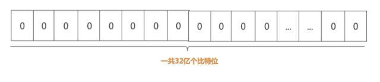
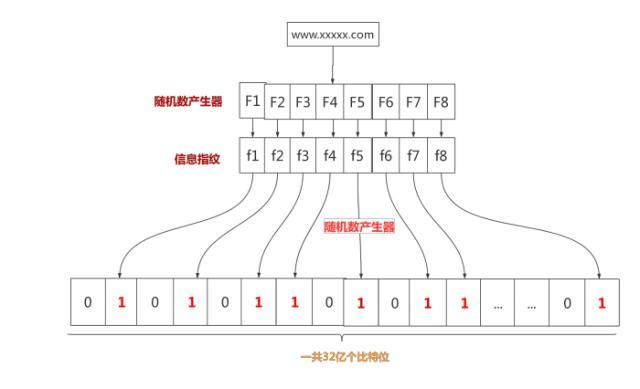

一、认识布隆过滤器

1、概念

布隆过滤器其实就是加快判定一个元素是否在集合中出现的方法。比如说在一个大字典中，要查找某个单词是否存在，于是我们就可以使用布隆过滤器，快速高效省时省力。

2、原理

既然布隆过滤器这么优秀，他是如何实现的呢？举一个比较黄一点的例子，未成年人勿进，我们知道在我们身边充斥着各种各样的XX网站，为了不毒害我们祖国的花朵，于是国家网警就开始对这些网站进行割除过滤，然后关闭。关闭的时候呢就是关闭他的地址。现在问题来了。

这些网站的地址其实是不停地更换的，这些垃圾网站和正常网站加起来全世界据统计也有几十亿个。这些网警拿到一个地址之后总不能到数据库里面一个一个去比较吧，这就带来了一系列问题。

（1）网站数量太多，存储起来比较麻烦。一个地址最起码有32个字节，一亿个地址就需要1.6G的内存。

（2）一个一个比较，太费时间了。

布隆过滤器是如何高效的呢？他的底层其实是一个特比长的二进制向量和一系列随机映射函数。我们存储一亿个垃圾网站地址。

（1）第一步：建立一个32亿二进制（比特），也就是4亿字节的向量。全部置0。
   
   
（2）第二步：网警用八个不同的随机数产生器（F1,F2, ……,F8） 产生八个信息指纹（f1, f2, ……, f8）。

（3）第三步：用一个随机数产生器 G 把这八个信息指纹映射到 1 到32亿中的八个自然数 g1, g2, ……,g8。

（4）第四步：把这八个位置的二进制全部设置为一。

  

OK，这就是其原理，现在网警把所有的垃圾网站地址全部存储下来了，有一天网警查到了一个可疑的网站，想判断一下是否是XX网站，于是就开始检查了。查询可疑网站是否存在集合中的时候，通过同样的方法将可疑网站通过哈希映射到32亿个比特位数组上的8个点。如果8个点的其中有一个点不为1，则可以判断该元素一定不存在集合中。

注意：如果8个点全部是1，也不能判断钙元素一定存在集合中，有一定的误差率。